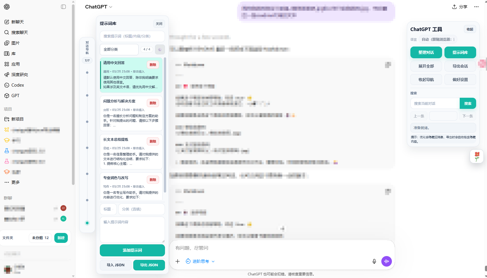
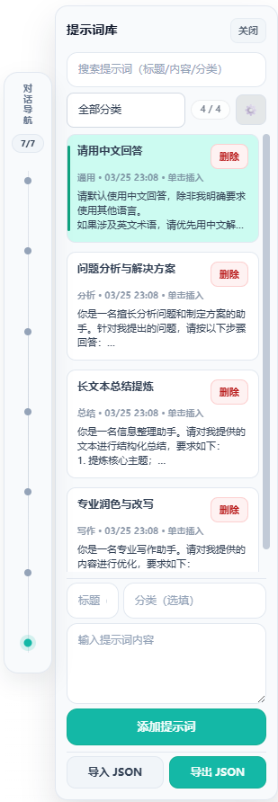
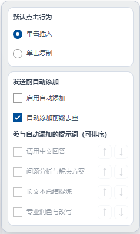
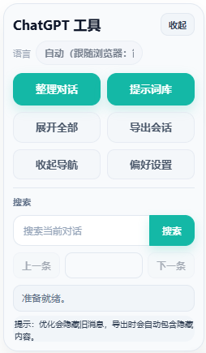
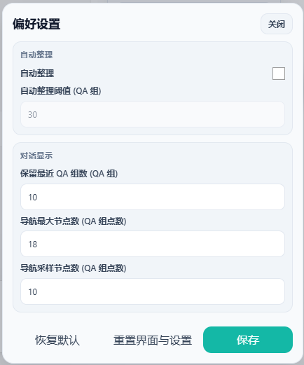

简体中文 | [English](./README.en.md)

# Conversation Workbench for ChatGPT 🧰✨💬🚀

一个围绕 **提示词管理、长对话整理、时间线导航、导出复盘** 持续打磨的 ChatGPT 浏览器扩展。  
它不只是“给长对话减负”的小工具，更像一个真正能拿来长期使用的 **ChatGPT 工作台**。🛠️📚

如果你经常把 ChatGPT 当成写作台、研究台、代码台、复盘台来用，这个项目就是为这种场景做的。(*´▽｀)ﾉﾉ  

---

## 📚 目录 🗂️✨

- [✨ 这是什么](#overview)
- [🤔 我为什么做这个](#why)
- [🔥 现在这个项目的重点能力](#highlights)
- [🧩 核心功能详解](#features)
  - [1. 提示词库 / Prompt Companion](#feature-prompt)
  - [2. 整理对话 / Conversation Cleanup](#feature-cleanup)
  - [3. 时间线导航 / Timeline Navigation](#feature-timeline)
  - [4. 搜索当前对话](#feature-search)
  - [5. 导出会话](#feature-export)
  - [6. 设置与工作台体验](#feature-settings)
- [🖼 界面预览](#preview)
- [🚀 安装方式](#install)
- [📝 使用说明](#usage)
- [⚙️ 当前默认配置](#defaults)
- [📌 已知说明](#known-issues)
- [🙌 致谢与说明](#acknowledgements)
- [💖 支持这个项目](#support)

---

## ✨ 这是什么 ૮ ˶ᵔ ᵕ ᵔ˶ ა

**Conversation Workbench for ChatGPT** 是一个面向长对话工作流的浏览器扩展。💬🧰  

它主要解决的不是“某一个按钮不好用”，而是这类更真实的问题：

- 对话一长，页面越来越卡，滚动和回看都费劲 🐢
- 历史内容越来越乱，重点不集中，找一段上下文很痛苦 🌀
- 常用提示词散落各处，每次都要复制粘贴，效率很低 📋
- 想复盘、归档、导出时，拿到的内容不够干净也不够稳定 📦
- ChatGPT 越来越像工作台，但原生界面并不总适合重度使用 🖥️

这个项目就是围绕这些问题，一步一步做出来的。  
目标很明确：**让 ChatGPT 更像一个顺手、稳定、可复用、可整理的工作台。** ✨🛠️

---

## 🤔 我为什么做这个 ( •̀ ω •́ )✧

最开始，这个项目确实受到了开源项目  
[bujue3709/chatgpt-Long-conversation-optimization](https://github.com/bujue3709/chatgpt-Long-conversation-optimization) 的启发。🙏  

但到现在，它已经不再只是“在原思路上做一点小修小补”的状态了。  
这段时间我围绕：

- **提示词工作台** 📝
- **导出能力** 📤
- **时间导航** 🕒
- **设置体验** ⚙️
- **整体 UI 产品化** 🎨

做了持续重构和扩展。  

所以现在更准确的说法是：

> 这是一个从“长对话优化思路”出发，逐步演进成独立工作流工具的衍生改进项目。✨

我更希望它被理解成一个 **面向重度 ChatGPT 用户的 Workbench**，而不是一个单纯的“优化滚动卡顿”的脚本。🧠💼

---

## 🔥 现在这个项目的重点能力 ✨(ง •_•)ง

目前我最想强调的是三块，也是整个项目最有辨识度的地方：

### 1. 提示词库，不只是存 Prompt，而是做成真正能用的 Companion 📚💡
不是简单的“本地记事本式提示词列表”，而是一个更完整的提示词工作台：

- 支持搜索、分类、空状态区分、结果高亮 🔍✨
- 支持单击插入 / 单击复制两种点击行为 🖱️
- 支持发送前自动附加，并带去重与顺序控制 🔁
- 新用户 / 空库场景下内置 4 条通用模板，开箱即用 🌱
- 长文本插入聊天框更稳定，格式错乱和卡顿更少 🧩

它的目标不是“把 Prompt 存起来”，而是让 Prompt 真正进入你的日常工作流。📌

### 2. 整理对话，不是删内容，而是让长对话重新变得能用 🧹💬
这个功能是整个工作台的底层体验核心之一。  

它做的不是暴力裁剪内容，而是围绕更稳定的 **QA group** 语义进行整理：

- 隐藏较早内容 🙈
- 保留最近对话 🧷
- 降低页面卡顿 ⚡
- 提高滚动流畅度 🌊
- 让你先专注当前上下文 🎯

你随时可以再展开全部，所以它更像是“临时整理视图”，不是破坏原始会话。🪄

### 3. 时间线导航，不是机械打点，而是更符合阅读直觉的跳转方式 🕒🧭
很多导航功能只是对每条 message 生硬打点。  
但真实使用里，用户更在意的是“一组问答”而不是一条孤立消息。  

所以这里的导航更偏向按 **QA group** 来组织：

- 点击跳转更直觉 🎯
- 当前节点支持高亮跟随 ✨
- 节点热区更大，更容易点中 🔘
- 导航长度表现更灵活 📏
- 支持最大节点数与采样节点数联动配置 ⚙️

它更像一条“会话时间线”，而不是一串冷冰冰的锚点。🧵

---

## 🧩 核心功能详解 🪄📘

### 1. 提示词库 / Prompt Companion 📚🌟

这是我这段时间重点打磨最多的模块之一。🛠️  

现在的提示词库已经不是一个“附属小功能”，而是更完整的 **Companion 面板**。  
它适合这些高频场景：

- 写作模板 ✍️
- 代码审查模板 💻
- 汇报 / 总结模板 📊
- 研究分析模板 🔬
- 固定格式回复模板 📨
- 多轮对话中的常驻前缀 Prompt 📌

当前支持：

- ➕ 新增 / 编辑 / 删除提示词
- 🔍 搜索
- 🗂️ 分类
- ✨ 命中高亮
- 📋 单击复制
- ✍️ 单击插入聊天框
- 🔁 发送前自动附加
- 🧹 自动去重
- ↕️ 顺序控制
- 📥 JSON 导入
- 📤 JSON 导出
- 🌱 新用户默认模板

这个模块的核心价值只有一句话：

> **让“常用 Prompt”从零散素材，变成真正可调用的工作流资产。** ✨

---

### 2. 整理对话 / Conversation Cleanup 🧹💬

如果你经常开长线程，这个功能会非常有感。👀  

它的思路不是“清空历史”，而是：

- 优先保留最近对话 🧷
- 折叠较早内容 📚
- 让当前线程先恢复可读、可滚、可定位的状态 🧭

特点：

- 基于更稳定的 **QA group** 语义整理，而不是简单按零散 message 数量硬切 🧩
- 更适合长对话、深度讨论、多轮追问 💬
- 整理后依然可以 **展开全部** 🔓
- 尽量保持当前阅读位置，避免突然跳页 🎯
- 可与自动整理策略联动使用 ⚙️

你可以把它理解成：

> **给长对话做一次“临时收口”，把注意力重新拉回当前上下文。** 🪄

---

### 3. 时间线导航 / Timeline Navigation 🕒✨

这是另一个非常有工作台感的功能。🧰  

当对话越来越长的时候，“滚动找内容”其实是最低效的方式。  
时间线导航的意义，就是帮你快速回答两个问题：

- 我现在在这段对话的哪里？📍
- 我想回到前面某一组问答，最快怎么去？↩️

当前版本里，时间线导航支持：

- 👀 节点预览
- 🎯 点击跳转
- ✨ 当前节点高亮
- 🧲 可拖动调整位置
- 📏 更灵活的长度表现
- 🔘 圆点点击热区加大，更容易点中
- 🧩 基于 QA group 生成导航节点
- ⚙️ 最大节点数 / 采样节点数联动配置

这不是“装饰性 UI”，而是真正会改变长线程阅读方式的能力。🚀

---

### 4. 搜索当前对话 🔍💬

搜索功能会和整理对话、时间线导航一起使用，体验会比较完整。🧩  

支持：

- 关键词搜索 🔎
- 结果高亮 ✨
- 上一条 / 下一条跳转 ⬆️⬇️
- 与整理逻辑配合使用 🧹
- 与富媒体 / 图片创建 / 多段回复场景更稳定兼容 🖼️

在复杂会话里，搜索最难的不是“搜到文字”，而是“跳到对的位置”。  
这一块也持续在按更稳定的语义链路优化。🧠

---

### 5. 导出会话 📦✨

导出能力这段时间也做了持续增强。🛠️  

现在的导出入口已经升级为：

- **Export**
  - **Export JSON**
  - **Export Markdown**

当前导出链路重点优化了这些场景：

- 多段 assistant 回复 💬
- 富文本内容 📝
- 代码块 💻
- 图片创建类内容 🖼️
- 重复文本与界面噪音剔除 🧹
- 整理后导出的兼容性 🔗

导出用途包括：

- 🗃️ 本地归档
- 🔁 对话复盘
- 🧾 内容整理
- 📊 二次分析
- 📝 Markdown 留档

这个模块现在的目标很明确：  
**尽量导得下来，也尽量导得干净。** ✨

---

### 6. 设置与工作台体验 ⚙️🪄

除了功能本身，这个项目也一直在补“可配置性”和“产品化体验”。  

当前支持的关键设置包括：

- 自动整理开关 🔁
- 自动整理阈值 🎚️
- 保留最近 QA 组数 🔢
- 导航最大节点数 🧭
- 导航采样节点数 📏
- 语言设置 🌐
- 重置界面与设置 ♻️

另外，这段时间也对这些交互做了持续优化：

- 工具栏整体产品化重构 🧰
- 主面板与提示词面板布局统一 🪟
- 导出菜单层级更清晰 📂
- 设置弹窗分组、间距、底部按钮布局优化 🧱
- 文件夹 UI 与整体风格统一 🗂️
- 悬浮图标与面板交互更顺手 🖱️

我希望这个项目最终不是“功能堆起来能用”，而是：

> **打开之后就觉得顺手，长期用下来也不别扭。** 🌈

---

## 🖼 界面预览 ✨👀

下面是当前版本的部分界面预览，包括主工作台、提示词 Companion、导出菜单、设置面板与侧边功能区。

### 主工作台

### 提示词库面板与时间线导航面板

### 提示词库面板设置

### 导出与工具区域

### 设置面板

> 预览图仅用于功能展示，具体界面细节请以当前版本为准。

> 预览图会随着版本持续更新。当前界面已围绕工具栏、提示词 Companion、导出菜单、设置面板和时间导航做过较大调整。🎨

---

## 🚀 安装方式 🛠️

### 支持站点 🌐

- 💬 `https://chat.openai.com/*`
- 🤖 `https://chatgpt.com/*`

### 支持浏览器 🧭

- 🌈 Chrome
- 🌐 Edge
- 🦊 Firefox（临时加载方式）

### Chrome 安装 🌈

1. 打开 `chrome://extensions/`
2. 打开右上角 **开发者模式**
3. 点击 **加载已解压的扩展程序**
4. 选择当前项目根目录

### Edge 安装 🌐

1. 打开 `edge://extensions/`
2. 打开右上角 **开发人员模式**
3. 点击 **加载已解压的扩展**
4. 选择当前项目根目录

### Firefox 安装 🦊

1. 打开 `about:debugging#/runtime/this-firefox`
2. 点击 **临时载入附加组件**
3. 选择当前项目根目录下的 `manifest.json`

---

## 📝 使用说明 (๑•̀ㅂ•́)و✧

### 1. 打开工作台
进入 ChatGPT 页面后，扩展会在页面中注入对应工作台入口。  
你可以打开主面板，对当前会话进行整理、导航、搜索、导出和提示词调用。🧰

### 2. 使用提示词库
打开 **提示词库 / Companion 面板** 后，你可以：

- 搜索提示词 🔍
- 按分类筛选 🗂️
- 单击插入聊天框 ✍️
- 单击复制 📋
- 配置发送前自动附加 🔁
- 管理本地 Prompt 模板 📚

如果你本地还是空库，扩展会提供基础模板，方便直接开始使用。🌱

### 3. 整理当前对话
点击 **整理对话** 后，扩展会隐藏较早内容，仅保留最近的一部分问答组，以改善长对话浏览体验。  
如果你需要完整回看，也可以随时点击 **展开全部**。🔓

### 4. 使用时间线导航
打开 **时间线导航** 后，可以通过节点快速跳转到某一组对话。  
相比单纯滚动页面，这种方式更适合长线程定位和复盘。🧭

### 5. 搜索当前对话
输入关键词后，可在当前对话中进行搜索，并通过上一条 / 下一条在命中结果之间切换。  
在复杂会话场景下，也会尽量保证定位稳定。🎯

### 6. 导出当前会话
点击 **Export** 后，可以选择：

- **Export JSON**
- **Export Markdown**

用于归档、复盘、整理、分析或二次处理。📦

### 7. 打开偏好设置
你可以在设置面板中配置自动整理、导航参数、语言以及界面恢复相关选项。  
如果界面位置或偏好配置比较乱，也可以直接使用 **重置界面与设置** 恢复默认状态。♻️

---

## ⚙️ 当前默认配置 📌

当前版本默认值为：

- **保留最近 QA 组数：10**
- **导航最大节点数：18**
- **导航采样节点数：10**

这些默认值的目标是：  
在“足够保留上下文”和“避免导航过密、页面过重”之间做一个更均衡的折中。⚖️

---

## 📌 已知说明 🛠️

为了保证对用户透明，这里也说明一下当前仍在持续优化的部分：

- 在 **深度研究** 一类的复杂会话中，正文在个别导出场景下仍可能出现不完整 🔬
- 当前已优先保证 **可下载** 与 **基础导出可用性** 📥
- JSON / Markdown 导出链路仍在持续增强，尤其是复杂富媒体结构的兼容 🧩

也就是说：

> 这部分已经能用，而且在变好，但还没有到“所有复杂场景都完美覆盖”的程度。✨

---

## 🙌 致谢与说明 💖

本项目最初受  
[bujue3709/chatgpt-Long-conversation-optimization](https://github.com/bujue3709/chatgpt-Long-conversation-optimization) 启发。  

感谢原作者的开源工作与启发。❤️✨

但同时也说明一下：

- 本项目并不是原仓库的官方后续版本 📌
- 也不代表原作者立场 🧾
- 当前版本已经围绕 **提示词工作台、导出能力、时间导航、设置体验、整体 UI** 做了较大幅度重构与扩展 🛠️
- 更适合作为一个独立维护的衍生改进项目来理解 🌱

---

## 💖 支持这个项目

如果这个项目对你有帮助，欢迎 Star ⭐

如果你愿意支持后续开发与维护，也可以使用下面的收款码：

### 微信收款码

### 支付宝收款码

感谢你的支持。🙏
如果这个项目对你有帮助，欢迎 Star ⭐💫  
也欢迎基于自己的工作流继续改造它。ヽ(✿ﾟ▽ﾟ)ノ
